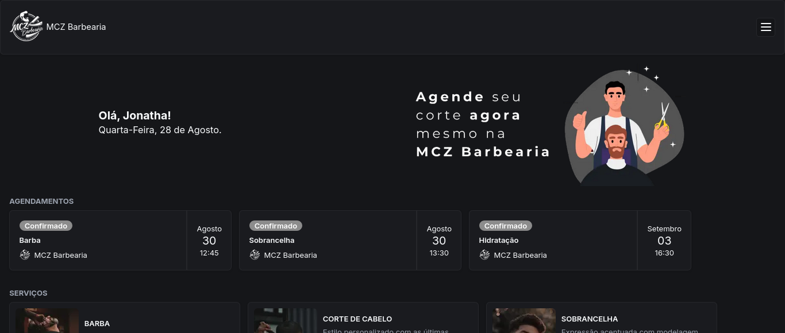

### MCZ Barbearia

---



Projeto desenvolvido para agendamento dos serviços online da barbearia. O sistema permite que os clientes visualizem os serviços oferecidos, agendem uma reserva na data e horário desejados.

- Catálogo de serviços:
Apresenta uma lista detalhada dos serviços oferecidos, como cortes de cabelo, barbear, tratamentos capilares, entre outros.

- Agendamento  de reservas: 
Sistema intuitivo de agendamento, onde o cliente pode escolher o serviço, barbeiro, data e hora. ou reagendar compromissos.

- Login com Google:
Sistema seguro de autenticação para clientes feito com Google.
---

Feito com React, TypeScript, Prisma, PostgreSQL, Tailwind CSS, Next.js, SHADCN UI e Node.js.

---
This is a [Next.js](https://nextjs.org/) project bootstrapped with [`create-next-app`](https://github.com/vercel/next.js/tree/canary/packages/create-next-app).

### Getting Started

First, run the development server:

```bash
npm run dev
# or
yarn dev
# or
pnpm dev
# or
bun dev
```

Open [http://localhost:3000](http://localhost:3000) with your browser to see the result.

You can start editing the page by modifying `app/page.tsx`. The page auto-updates as you edit the file.

This project uses [`next/font`](https://nextjs.org/docs/basic-features/font-optimization) to automatically optimize and load Inter, a custom Google Font.
